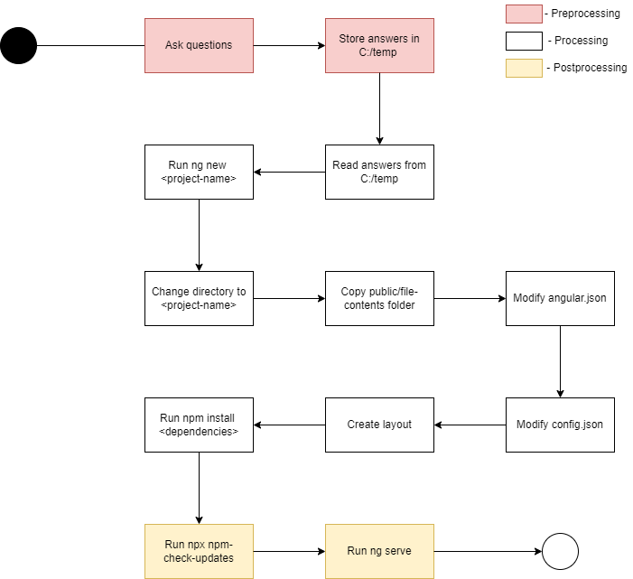
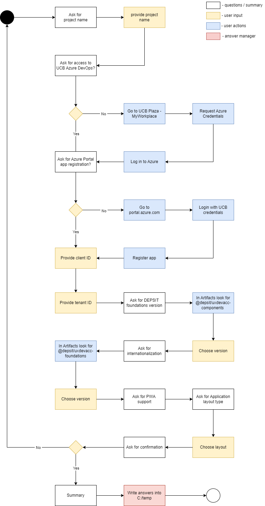

# Create Generator is a Vite Typescript project used to automatically generate Angular frontend based on questions displayed to user

## By default it installs

- Depsit web components and foundations
- Basic homepage and application layout
- MSAL integration for authentication
- Microsoft GraphQL integration
- NgRx for state management
- Pre-build components
- ESLint for linting
- Jest for testing
- Service layer
- Depsit CSS

### Package process

- Preprocessing - ask the user questions about the application and store answers in a temp file
- Processing - read answers, generate the code & layout and install dependencies & packages
- Postprocessing - checking the generated project and starting the application

#### Visual Helper for the package process

# Instructions

## Prerequisites

- An app registered in Azure portal with Client and Tenant IDs
- Access to the UCB Azure DevOps
- Stable network connection
- Node.js

### 1. Navigate to directory where you want to generate project

For example:

    cd C:/temp

### 2.1 Set registry to Depsit Azure Artifacts

    npm config set registry https://pkgs.dev.azure.com/ucbalm/DEPSIT/_packaging/depsit/npm/registry/

#### 2.2 Verify by running

    npm get registry

### 3. Run

    npm init @angular/generator@version

### 4. Answer the questions about your project

#### 4.1 What is the name of your Angular project?

For example:

    test-project-name

#### 4.2 Do you have access to the UCB Azure DevOps?

    n + ENTER for no or ENTER for yes

#### 4.3 Do you have an app registered in the Azure portal?

    n + ENTER for no or ENTER for yes

#### 4.4 What is your client ID?

For example:

    123abc4d-ab12-12ab-1a23-ab123a1ab1ab

#### 4.5 What is your tenant ID?

For example:

    12ab1234-1ab2-1ab2-1a2b-1a2b345a123a

#### 4.6 What version of DEPSIT web components would you like to use? ↕️

For example:

    1.0.7

#### 4.7 What version of DEPSIT foundations would you like to use? ↕️

For example:

    1.0.2

#### 4.8 What kind of application layout would you like to use? ↕️

    Basic layout

#### 4.9 Is everything OK with the settings above?

    n + ENTER for no or ENTER for yes

If you say no to this question, it will start the question process again.

### Visual Helper for preprocessing

# Usage

## For local development

### 1. In one terminal start the local registry by running 

    verdaccio

### 2. Increment the version in package.json 

Otherwise when pushing to the local registry it will throw an 409 conflict, meaning that the package already exists.

### 3. Build the project by running 
    
    npm run build 

### 4 Publish to the local registry

    npm publish --registry=http://localhost:4873    
                                       

### 5. Start the package process in another folder

    npm init @angular/generator@latest --registry=http://localhost:4873

### Publishing to the ucb azure devops artifacts feed

Increment the version in package.json that follows up on the previous versions in the feed. 

Then build the project.

#### Authenticate

    vsts-npm-auth -config .npmrc -force

#### Publish

    npm publish --registry=https://pkgs.dev.azure.com/ucbalm/DEPSIT/_packaging/depsit/registry/      

## Testing 

Run tests by running 

    npx vitest

Or to run test with coverage 

    npx vitest run --coverage